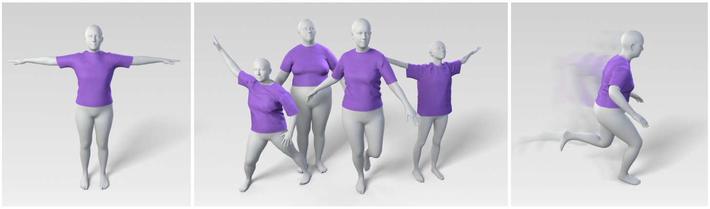
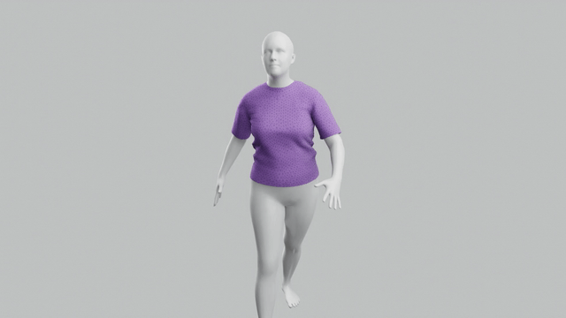

# Learning-Based Animation of Clothing for Virtual Try-On



[[Project website](https://dancasas.github.io/projects/LearningBasedVirtualTryOn/)] [[Dataset](https://github.com/isantesteban/vto-dataset)] [[Video](https://youtu.be/o2KJoAhEGg8)]

## Abstract

>This paper presents a learning-based clothing animation method for highly efficient virtual try-on simulation. Given a garment, we preprocess a rich database of physically-based dressed character simulations, for multiple body shapes and animations. Then, using this database, we train a learning-based model of cloth drape and wrinkles, as a function of body shape and dynamics. We propose a model that separates global garment fit, due to body shape, from local garment wrinkles, due to both pose dynamics and body shape. We use a recurrent neural network to regress garment wrinkles, and we achieve highly plausible nonlinear effects, in contrast to the blending artifacts suffered by previous methods. At runtime, dynamic virtual try-on animations are produced in just a few milliseconds for garments with thousands of triangles. We show qualitative and quantitative analysis of results.

# Running the model

**Requirements**: ```python3.8```, ```tensorflow-2.2.1```, ```numpy-1.18.5```, ```scipy-1.7.1```, ```chumpy-0.70```

**Project structure**:
```
vto-learning-based-animations
│
└───assets 
|    └─ images    
|    └─ meshes    
|    └─ CMU         # Not included, see instructions
|    └─ SMPL        # Not included, see instructions
| 
└───rendering       # Code to render meshes 
|
└───src             # Code to run the model
| 
└───trained_models    
|    └─ tshirt      # Not included, see instructions     
│
└───run_model.py
```

## Download trained models

1. Download models from https://github.com/isantesteban/vto-learning-based-animation/releases/download/trained-model/trained_models_tshirt.zip
2. Create ```trained_models``` directory and extract ```trained_models_tshirt.zip``` there.

## Download human model

1. Sign in into https://smpl.is.tue.mpg.de
2. Download SMPL version 1.0.0 for Python 2.7 (10 shape PCs)
3. Extract ```SMPL_python_v.1.0.0.zip``` and copy ```smpl/models/basicModel_f_lbs_10_207_0_v1.0.0.pkl``` in ```assets/SMPL```

## Download animation sequences

1. Sign in into https://amass.is.tue.mpg.de
2. Download the body data for the CMU motions (SMPL+H model)
3. Extract ```CMU.tar.bz2``` in ```assets/CMU```:  
```sh
tar -C assets/ -xf ~/Downloads/CMU.tar.bz2 CMU/ 
```

## Generate garment animation

To generate the deformed garment meshes for a given sequence:

```sh
python run_model.py assets/CMU/07/07_02_poses.npz --export_dir results/07_02
```


# Rendering
**Requirements**: ```blender-2.93```, ```ffmpeg```

To render the meshes:

```sh
blender --background rendering/scene.blend --python rendering/render.py --path results/07_02
```



# Citation

If you find this repository useful please cite our work:

```
@article {santesteban2019virtualtryon,
    journal = {Computer Graphics Forum (Proc. Eurographics)},
    title = {{Learning-Based Animation of Clothing for Virtual Try-On}},
    author = {Santesteban, Igor and Otaduy, Miguel A. and Casas, Dan},
    year = {2019},
    ISSN = {1467-8659},
    DOI = {10.1111/cgf.13643}
}
```

